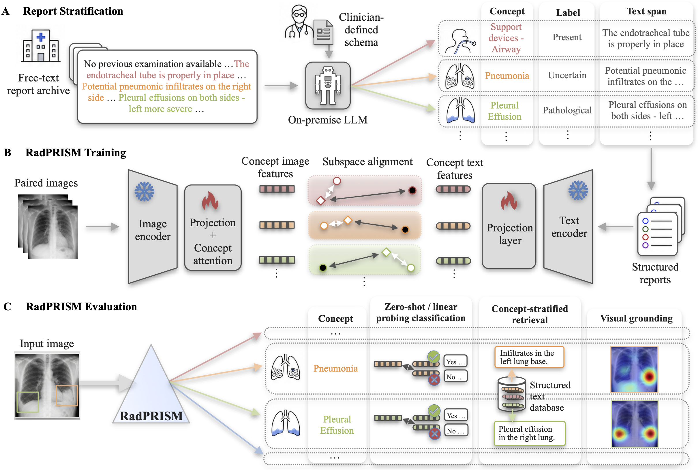

<h1 align="center">RadPRISM</h1>

<p align="center">
  <b>Schema-stratified radiology-report supervision for<br>
  concept-disentangled image representations and visual grounding</b>
</p>

<p align="center">
  Vision-language pretraining learns rich medical image representations from radiology reports, but previous model variants commonly operate within a single shared embedding space, so concept-level structure and interpretability must be recovered post hoc, limiting model transparency and, hence, clinical utility. We introduce RadPRISM, which makes a clinician-defined radiology schema a well-defined stratification axis: an on-premise large language model extracts per-concept text spans from free-text reports, and each clinical concept is aligned in its own dedicated visual subspace, turning concept stratification into direct, top-level alignment supervision. RadPRISM yields discriminative, spatially faithful, natively concept-stratified representations shaped by and transparently inspectable by clinicians.
</p>

<p align="center">
  
</p>

<p align="center">
  <sub><b>(A)</b> An on-premise LLM stratifies free-text reports into per-concept
  text spans and labels using a clinician-defined schema · <b>(B)</b> RadPRISM
  aligns each concept in its own visual subspace · <b>(C)</b> the trained model
  supports concept classification, concept-stratified retrieval, and visual
  grounding.</sub>
</p>

This repository contains the custom code for the three stages above — report
structuring/labeling, training, and evaluation — plus a small runnable dummy
dataset and a ready-to-use trained checkpoint.


## Repository layout

```
RadPRISM/
├── report_struct_label/   # Stage 0: LLM structuring + labeling + text embedding of reports
├── src/                   # Shared model + data code (used by training AND evaluation)
│   ├── model.py           #   VisionConceptModel (backbone, cross-attention, heads)
│   ├── losses.py          #   InfoNCE alignment loss + BCE classification loss
│   └── dataset.py         #   datasets, splits, transforms, weighted sampling
├── training/              # Stage 1+2: alignment pretraining + classification fine-tuning
├── evaluation/            # Stage 3: internal / CheXlocalize eval, inference demo, LLM check
├── utils/                 # Data-prep utilities (image cache, dummy dataset, text banks)
├── data/                  # Dummy dataset + the provided trained checkpoint
├── requirements.txt       # Combined environment (all stages)
├── LICENSE                # MIT
└── CITATION.cff
```

Each subfolder has its **own detailed README**:
[`report_struct_label`](report_struct_label/README.md) ·
[`training`](training/README.md) ·
[`evaluation`](evaluation/README.md) ·
[`data`](data/README.md) ·
[`checkpoint`](data/radprism_checkpoint/README.md).


## What each stage does

| Stage | Folder | Summary |
|---|---|---|
| **0. Report structuring & labeling** | `report_struct_label/` | An LLM turns free-text reports into structured JSON per concept; the snippets are embedded and the labels are extracted into sharded caches. |
| **1. Alignment pretraining** | `training/pretraining/` | Concept-averaged InfoNCE aligns image concept embeddings with the report text embeddings; concept-aware weighted sampling handles rare concepts. |
| **2. Classification fine-tuning** | `training/finetuning/` | Freezes the backbone/attention and trains per-concept binary classification heads. |
| **3. Evaluation & inference** | `evaluation/` | Internal metrics + retrieval, external CheXpert/CheXlocalize classification + grounding, an inference demo for the provided checkpoint, and an optional LLM consistency check. |


## Setup

```bash
pip install -r requirements.txt          # one environment for everything
```

Python 3.9 or newer is required.

For a lighter, component-specific install use the `requirements.txt` inside
`report_struct_label/`, `training/`, or `evaluation/`.

> **Troubleshooting — `sentence-transformers` import error.** In environments where
> a standalone **Keras 3** is installed, `transformers` may fail to import its TF
> integration (`Could not import module 'CodeCarbonCallback'` /
> `Keras 3 ... install the backwards-compatible tf-keras package`). Fix with either
> `pip install tf-keras`, or run the affected commands (report embedding, zero-shot /
> retrieval embedding, checkpoint text banks) with `USE_TF=0` in the environment.
> The PyTorch path itself is unaffected.

### External models (downloaded separately, not redistributed here)

| Model | Used for | Notes |
|---|---|---|
| **RAD-DINO-MAIRA-2** (Microsoft, HuggingFace) | vision backbone | Download locally and set `rad_dino_model_dir` / `model.rad_dino_model_dir`. Its MSRLA terms restrict use to non-commercial, non-revenue-generating research and prohibit redistribution. |
| **Qwen3-Embedding-4B** (Alibaba, Apache-2.0) | report / prompt text embeddings | Needed to (re)build text embeddings and the checkpoint's text banks. Only *derived embeddings* are shipped, not weights. |
| An **LLM endpoint** (OpenAI-compatible) | report structuring; optional consistency check | Only for those steps; both have model-free fallbacks/dummy paths. |


## Quickstart — run the dummy pipeline end-to-end (CPU, no external models)

The bundled demonstration dataset lets you verify the whole training/eval flow
without access to the private training dataset or downloaded models. From the
`RadPRISM/` root:

```bash
# 1. Build the dummy dataset (image/label/text caches + master index)
python utils/make_dummy_dataset.py

# 2. Alignment pretraining
python training/pretraining/train_run_pretrain.py --config training/config/pretrain_dummy.yaml

# 3. Classification fine-tuning
#    (edit training/config/finetune_cls_dummy.yaml: set <PRETRAIN_RUN>)
python training/finetuning/train_run_finetune_cls.py --config training/config/finetune_cls_dummy.yaml

# 4. Internal evaluation (thresholds + classification + retrieval)
#    (edit evaluation/config/evaluate_internal_dummy.yaml: set <FINETUNE_RUN>)
python evaluation/evaluate_internal.py --config evaluation/config/evaluate_internal_dummy.yaml
```

> The dummy set has ~20 tiny samples with random text embeddings — it verifies that
> the code runs and illustrates the expected data structure, **not** meaningful
> results. See [`data/README.md`](data/README.md).


## Try the provided trained model

A ready-to-use checkpoint ships in [`data/radprism_checkpoint/`](data/radprism_checkpoint/README.md)
as **trained weights only**; the frozen RAD-DINO-MAIRA-2 backbone is loaded
from your local HuggingFace copy. After the one-time setup in the checkpoint README
(download the backbone, build the text banks):

```bash
python evaluation/run_inference_demo.py --config evaluation/config/inference_demo.yaml
```

Per image this saves attention-overlay PNGs, a thresholded classification CSV, and
top-k text retrievals. An optional LLM step can then assess classification-vs-
retrieval consistency (`evaluation/llm_consistency_check.py`).


## Data & privacy

- The private clinical training dataset is not distributed here.
- The example reports and dummy text embeddings are synthetic. The bundled
  retrieval and zero-shot text databases are also synthetic.
- The seven bundled example chest X-rays are separately licensed; see
  [`data/jpg/README.md`](data/jpg/README.md).
- The 19 clinical concepts are English dot-paths (e.g. `pathologies.lung.pneumonia`),
  consistent across the report pipeline, training, and evaluation.


## License & citation

- Original RadPRISM code and the distributed RadPRISM-trained tensors:
  **MIT** (see [`LICENSE`](LICENSE)).
- The seven example chest X-rays in `data/jpg/` are not covered by MIT and are
  separately licensed under **CC BY-NC 4.0**; see their
  [license and attribution notice](data/jpg/README.md).
- Other third-party models, dependencies, datasets, and artifacts are not
  relicensed.
  See [`THIRD_PARTY_NOTICES.md`](THIRD_PARTY_NOTICES.md) for the exact boundary.
- The complete inference/training system requires RAD-DINO-MAIRA-2, whose MSRLA
  terms currently limit use to non-commercial, non-revenue-generating research.
  The MIT license on RadPRISM does not remove that runtime restriction.
- If you use this repository or model, please cite the software using the metadata
  in [`CITATION.cff`](CITATION.cff).

> **Intended use / limitations.** RadPRISM is a research artifact. It is **not** a
> medical device and must not be used for clinical decision-making. Performance was
> established on a specific dataset/domain and may not transfer to other populations,
> scanners, or acquisition settings.
